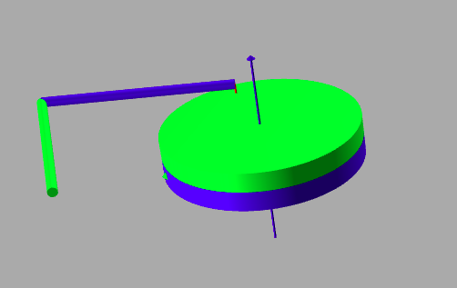

# Task for the part

**Task 1**
- For this part, you need to create a URDF similar to the one in the figure.
- The URDF is a 2R planar robot mounted on a revolving disc at a location near its circumference.
- Implement Inverse Kinematics for this system.
- Using the above implemented fuction, keep the system's end effector stationary while the disc keeps rotating.
- Consider any of the necessary constants on your own (i.e., lenght of links, radius of disc, etc).
###### - You are  allowed to use the inbuilt function in pybullet for calculating Inverse Kinematics.

    
    

Before moving on to the next task, It can get fairly complicated for building a IK function from scratch at times. So, Pybullet has an inbuilt function for solving the Inverse Kinematics for a given robot urdf. As the saying goes...*for enlightenment, read the bible!!!*

   
   [calculateInverseKinematics](https://docs.google.com/document/d/10sXEhzFRSnvFcl3XxNGhnD4N2SedqwdAvK3dsihxVUA/preview#heading=h.9i02ojf4k3ve)

You need to create the URDF file required to complete the above task on your own. Submit the URDF along with the .py file for the task in the following link:
Also submit short video of the working simulation on the link.
- [Submission_Link](https://forms.gle/n3cV9KfRjCeu4cp2A)
