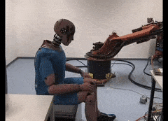

## Collisions
What is a collision?
* When a robot collides with a workpiece/a part of itself, then it is known as a collision.

<table align="center">
    <tr>
        <td> </td>
        <td> </td>
    </tr>
    <tr>
        <td > A cube with collision  </td>
        <td > A cube without collision  </td>
    </tr>
</table>

* We need functions in the simulator that detects this collision and brings the robot to an emergency stop.

 

## Self-collision:
* Self-collision is the collision among different links of a robot.
* By default, collision detection is enabled between different dynamic moving bodies. Self-collision between links of the same body can be enabled using flags such as 'URDF_USE_SELF_COLLISION' flag in loadURDF.
* Also, the urdf must have a collision model for the robot, you can refer to [dabba.urdf](dabba.urdf) and [sphere.urdf](sphere.urdf) to understand the inertial and collision tags on your own.

_More information on collisions can be found at -_
* [createCollisionShape](https://docs.google.com/document/d/10sXEhzFRSnvFcl3XxNGhnD4N2SedqwdAvK3dsihxVUA/preview#heading=h.q1gn7v6o58bf)
* [Collision Detection Queries](https://docs.google.com/document/d/10sXEhzFRSnvFcl3XxNGhnD4N2SedqwdAvK3dsihxVUA/preview#heading=h.hrpbzrwzgy1p)