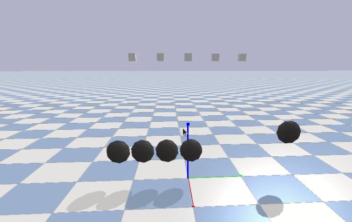

## Constraints:

There might be scenarios where we need to apply constraints in between the robot and a unit in the environment and simulate such constrained conditions

 

For example a robot walking around in a given circular track as depicted above.In the above arrangement thought the robot is a spatial body that can move in the 3d space independently with a dof = 6,we have constrained it to a central pivot using a bar to make it walk in a circular track.

The functions that enables you to design such constraints are listed below:

* [createConstraint, removeConstraint](https://docs.google.com/document/d/10sXEhzFRSnvFcl3XxNGhnD4N2SedqwdAvK3dsihxVUA/preview#heading=h.fq749wu22x4c)
 
* [changeConstraint](https://docs.google.com/document/d/10sXEhzFRSnvFcl3XxNGhnD4N2SedqwdAvK3dsihxVUA/preview#heading=h.fq749wu22x4c)

* [getNumConstraints](https://docs.google.com/document/d/10sXEhzFRSnvFcl3XxNGhnD4N2SedqwdAvK3dsihxVUA/preview#heading=h.hsbb69vwmyl0)

* [getConstraintUniqueId](https://docs.google.com/document/d/10sXEhzFRSnvFcl3XxNGhnD4N2SedqwdAvK3dsihxVUA/preview#heading=h.hsbb69vwmyl0)

* [getConstraintInfo/State](https://docs.google.com/document/d/10sXEhzFRSnvFcl3XxNGhnD4N2SedqwdAvK3dsihxVUA/preview#heading=h.zjkkp84f52f)

## Bonus Task - **THE NEWTON's CRADLE**.

 

Use the [sphere.urdf](sphere.urdf) as the bobs of the pendulums and use the in-built cube urdf as pins.The pins should be constrained and held **static** in a single point in space and the bob is to be kept at a constant length,suspended from the pin.The simulation should start with a **external force acting on the COM** of one of the bobs in the extreme positon.

**Note:** Its upto you to decide the number of spheres, suspension length, point of suspension,magnitude of initial force,etc.
Submit the code and video of the simulation [here](https://forms.gle/yupgvyz1eXmNHhxr6).
