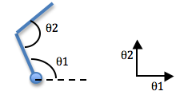

Let us learn a few things about robot's configuration and dynamics, theoretically ofcourse.
 

  
 <i>Theory Matters</i>

# Degree of Freedom (DoF):
Degree of Freedom, as you might remember from your JEE days is the number of independent motions, a system can have. Or to we can formulate it as the minimum number of real valued numbers required to describe the robot's current configuration. This is the DoF in robotics.
If you haven't missed you PHY101 lectures, then you must be familiar with the following general definition of DoF:
    
    Degree of Freedom = (Sum of freedom of the bodies) - (Number of independent constraints)

So, in my system, various joints can contribute to the DoF. But each joint is restricted in some way or the other. For example, a prismatic joint is constrained to move along a single axis and can hence contribute a single DoF. Now, to calculate the total DoF, we use **Grubler's Formula**.

### Grubler's Formula
If I assume an N-linked robot (where the base link is fixed to the ground) having J joints, then let $f_i$ be the number of freedoms by joint i and let $c_i$ be its number of constraints, then Grubler's Formula says that

$$\text{dof = rigid body freedom - joint constraints}$$

$$\text{dof = } m\left({N-1} \right) - \sum_{i=1}^J c_i$$

$$\text{dof = } m\left({N-1} \right) - \sum_{i=1}^J \left(m-f_i \right)$$

$$\text{dof = } m\left({N-1-J} \right) - \sum_{i=1}^J \left(f_i \right)$$

Here, m is the number of DoF that an individual body can have (i.e. 3 for spatial body and 2 for planar body). Note that $c_i + f_i = m$.

**Note:** This formula holds only if all joint constraints are independent. If they are not independent then the formula provides a lower bound on the number of degrees of freedom.

Following table summarizes the DoF for each type of joint:

|Joint Type|DOF f|Constraints c between two planar rigid bodies|Constraints c between two spatial bodies|
|:--------:|:---:|:-------------------------------------------:|:--------------------------------------:|
|Revolute (R)|1|2|5|
|Prismatic (P)|1|2|5|
|Helical (H)|1|-|5|
|Cylindrical (C)|2|-|4|
|Universal (U)|2|-|4|
|Spherical (S)|3|-|3|

> We are assuming that the bodies are rigid i.e., there can be no internal deformation. This assumption drastically simplified our mathematical model and is also applicable to the vast majority of robots present.

 
  <i>Let me take advantage of your DOF</i>
 

 
# Configuration Space
Now, that our system can have n DoF, we can define an n-dimensional configuration space (C-space), such that corresponding to every configuration of the system, there exists a point in that space, having some value for each of the n dimensions. All you need to do to is measure the values of all n coordinates and mark the point in the C-space. This will denote the current configuration of your dynamical system.
 

   

  <i>Here, the C-space has 2 dimensions $\left(\theta_{1} \text { and } \theta_{2} \right)$</i>
  

