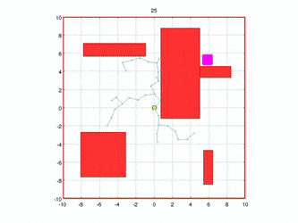

# Robotic Path Planning

Search algorithms are of great importance in robotics because they allow robots to effectively navigate their surroundings. Whether it's a self-driving car maneuvering through busy streets, a drone mapping an unknown area, or a search and rescue robot looking for survivors, search algorithms are at the heart of their capabilities.

These algorithms help robots overcome complex challenges by systematically exploring the search space, which represents all possible states or configurations the robot can encounter. By evaluating potential solutions and making informed decisions, search algorithms guide robots towards their goals.
<br><br>

# Search Based Algorithms
Once a space is represented as a graph, there are classic shortest-path graph algorithms that can guarantee the shortest path is found, if given unlimited computation time and resources.
One of such algoriths is [Dijkstra’s algorithm](https://en.wikipedia.org/wiki/Dijkstra%27s_algorithm), which uses the weights of the edges to find the path that minimizes the total distance (weight) between the source node and all other nodes.
However, we tend to opyimise such searches as much as possible, and thus comes the algorithm named A* 
<br><p align="center"></p>
<br>

## A*
[A*](https://en.wikipedia.org/wiki/Dijkstra%27s_algorithm) is another path-finding algorithm that extends Dijkstra’s algorithm by adding heuristics to stop certain unnecessary nodes from being searched. This is done by weighting the cost values of each node distance by their euclidean distance from the desired endpoint. Therefore, only paths that are headed generally in the correct direction will be evaluated.
<br><p align="center"></p>
     
At each iteration of its main loop, A* needs to determine which of its paths to extend. It does so based on the cost of the path and an estimate of the cost required to extend the path all the way to the goal. Specifically, A* selects the path that minimizes  
f(n)=g(n)+h(n)  
where n is the next node on the path, g(n) is the cost of the path from the start node to n, and h(n) is a heuristic function that estimates the cost of the cheapest path from n to the goal. <br>
**[Pseudocode of A*](https://en.wikipedia.org/wiki/A*_search_algorithm#Pseudocode)**
<br><br>

# Sampling-based planning
In reality, most algorithms do not need to reach full completion to find a reasonable path and doing so would be too computationally expensive. Therefore, most algorithms are resolution complete meaning that the algorithm is only as complete as the state-space is and discretization can play a large role in the accuracy of the result.

Sampling based planner are probabilistic complete, meaning that they create possible paths by randomly adding points to a tree until the best solution is found or time expires - as time approaches infinity, the probability of finding the optimal path approaches 1.

## Rapidly-exploring random trees (RRT)
[RRT](https://en.wikipedia.org/wiki/Rapidly_exploring_random_tree) quickly searches a space by randomly expanding a a space-filling tree until the desired target point is found. The basic algorithm is as follows, for some starting point, _start_, and a ending goal, _goal_.

```
tree = init(x, start)
while elapsed_time < t and no_goal(goal):
    new_point = stateToExpandFrom(tree)
    new_segment = createPathToTree(new_point)
    if chooseToAdd(new_Segment):
        tree = insert(tree, new_segment)
return tree
```
**stateToExpandFrom()** : finds the next into to add, which can be completely random search over the state space or can be informed by preferences around nodes with fewer out-degrees (i.e. less connections)  
**createpathToTree()**: this can use the classical shortest-distance graph algorithm for mapping a points to the tree, but that does necessarily choose the overall shortest path. RRT* is an extension of RRT which connects the point in a way that minimizes the overall path length - this is easiest to do when starting from the goal instead of the starting point.  
**chooseToAdd()**: needs to check for collisions which can be the most computationally expensive part, especially if the robot can run into itself. There are tricks for “lazy collision evaluation”, which only checks for collisions at suitable paths, and if a collision occurs then just that bad segment is deleted, while the rest of the path remains.
<br><p align="center"></p>
<br>
## RRT*

RRT* is an optimized version of RRT. The basic principle of RRT* is the same as RRT, however the difference comes from where we connect the new node int the existing tree.
we dont necessarily connct it to the nearest node, instead we check for other nodes within some specified search radius, to find a better way to connect these nodes, which minimises total path length.

RRT* creates incredibly straight paths. Additionally, its graphs are characteristically different from those of RRT. If the destination were to change, the original graph can still be used as it represents the quickest path to most locations in the region.

