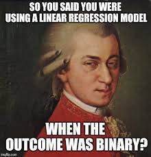
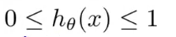
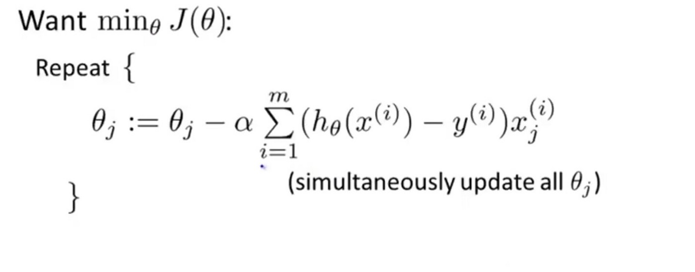
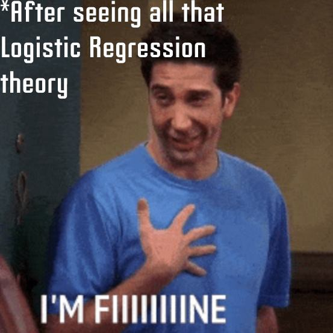

# Basics of Logistic Regression
<br><br>
<p align="center">

</p>

Logistic Regression is a Machine Learning algorithm which is used for the classification problems, it is a predictive analysis algorithm and based on the concept of probability.


Here, the cost function can be defined as the ‘**Sigmoid function**’ (Sigmoid function is the function maps any real value into another value between 0 and 1).
<br><br>
<p align="center">

</p>

And, the hypothesis of logistic regression tends it to limit the cost function between 0 and 1.
<br><br>
<p align="center">

</p>

### Cost Function
For logistic regression, the Cost function is defined as:

−log(hθ(x)) if y = 1

−log(1−hθ(x)) if y = 0
<br>
<p align="center"/>

<br><br>
<p align="center">

</p>
These two Function can be shown as
<br><br>
<p align="center">

</p>

The above two functions can be compressed into a single function i.e.
<br><br>
<p align="center">

</p>

### Gradient Decent for Logistic Regression

The general idea of gradient descent is to minimize the cost value. i.e. min J(θ)
<br><br>
<p align="center">

</p>
So, to minimize our cost function one has to run the gradient descent function on each parameter.
<br><br>
<p align="center">

</p>
And, the algorithm will not stop until it converges i.e.
<br><br>
<p align="center">

</p>

That's all for basics of Logistic Regression.
<br><br>
<p align="center">

</p>
Now the question arises what you had to do now.
<br><br>
<p align="center">

</p>
So, let's implement it.

### Implementation of Logistic Regression in Python
Stepwise guide for implementation

#### 1. First, import the package
```python
from sklearn import datasets
import numpy as np
import pandas as pd
import matplotlib.pyplot as plt

# Import Scikit-Learn to allow us to run Logistic Regression
from sklearn.linear_model import LogisticRegression
```
#### 2. Creating data for our model

The data we are creating contain features associated with age, weight, and average heart rate. Our approval decision will be a column called approved and will contain 0 or 1's indicating whether or not the patient was approved. 0 means the patient was not approved, 1 meaning the patient was approved.
```python
# Sample Data
approved = np.array([1, 1, 1, 0, 0, 0, 1, 1, 0, 0])
age = [21, 42, 35, 33, 63, 70, 26, 31, 52, 53]
weight = [110, 180, 175, 235, 95, 90, 175, 190, 250, 185]
avg_hrt = [65, 70, 72, 77, 67, 62, 68, 65, 73, 75]
```
#### 3.Structuring the features and labels
We stack the multiple Python arrays into one numpy object. Also, specifying the “shape” of the approved array.
```python
# Combining the multiple lists into one object called "X"
X = np.column_stack([age, weight, avg_hrt])

# Reshaping the approvals to work with scikit learn
y = approved.reshape(len(approved), )
```

#### 4. Building a Logistic Regression model
First we instantiate the model.
```python
# Instantiating the model object
model = LogisticRegression()
```
Now we can fit the model with data. This is how we can approximate a patient’s approval status — given their age, weight, and average resting heart rate.
```python
# Fitting the model with data
fitted_model = model.fit(X, y)
```

#### 5. Test the model on new data
Create new data
```python
new_age = [20, 45, 33, 31, 62, 71, 72, 25, 30, 53, 55]
new_weight = [105, 175, 170, 240, 100, 95, 200, 170, 195, 255, 180]
new_avg_hrt = [64, 68, 70, 78, 67, 61, 68, 67, 66, 75, 76]

# Combining the multiple lists into one object called "test_X"
test_X = np.column_stack([new_age, new_weight, new_avg_hrt])
```

#### 6. Run new data through the model
```python
results = fitted_model.predict(test_X)
```
#### 7. Take a look at the results
```python
print(f"Our approval results are: {results}")
```
`Our approval results are: [1 1 1 0 0 0 0 1 1 0 0]`

As you can see Scikit Learn automatically set a threshold for us and determined our approvals. If you want to look at the actual probabilities, we can use a different function provided by Scikit Learn - `predict_proba():`

```python
results_w_probs = fitted_model.predict_proba(test_X)
print("Our approval results with their probabilites:")
for result in results_w_probs:
    print(f"Probability not approved = {result[0]:.2f}, Probability approved = {result[1]:.2f}")
```
Output
```Our approval results with their probabilites:
Probability not approved = 0.00, Probability approved = 1.00
Probability not approved = 0.28, Probability approved = 0.72
Probability not approved = 0.00, Probability approved = 1.00
Probability not approved = 0.84, Probability approved = 0.16
Probability not approved = 0.92, Probability approved = 0.08
Probability not approved = 0.99, Probability approved = 0.01
Probability not approved = 1.00, Probability approved = 0.00
Probability not approved = 0.00, Probability approved = 1.00
Probability not approved = 0.00, Probability approved = 1.00
Probability not approved = 1.00, Probability approved = 0.00
Probability not approved = 1.00, Probability approved = 0.00
```
For more you can refer to some references given below:
* <a href="https://towardsdatascience.com/logistic-regression-detailed-overview-46c4da4303bc" target="_blank">Reading</a>
* `StatsQuest`:  <a href="https://www.youtube.com/playlist?list=PLblh5JKOoLUKxzEP5HA2d-Li7IJkHfXSe" target="_blank">Youtube Playlist</a>
* `Logistic Regression in Python`: https://youtu.be/JDU3AzH3WKg

## Softmax Regression (Bonus)

You learned logistic regression is used in case of binary classification. Softmax Regression is the multiclass version of logistic regression and is used for multiclass prediction.<br> 

To learn more: https://rasbt.github.io/mlxtend/user_guide/classifier/SoftmaxRegression/


